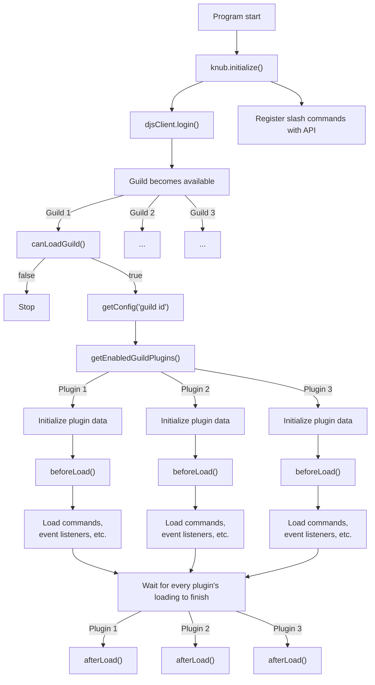

# Overview

A bot built on Knub consists of one or more **plugins**.
These plugins can either be **guild plugins** or **global plugins**:

* **Guild plugins** are loaded and configured separately for each server.  
  Most of your plugins will be guild plugins!

* **Global plugins** are only loaded once, with a global configuration.  
  These are best used for handling DMs or creating bot owner commands.

Each plugin consists of **commands** and **event listeners**:

* **Commands** are, well, commands. Knub supports both [slash commands](slash-commands.md) and message commands, though the former is recommended for any new bots.
* **Event listeners** run in response to an event from the bot gateway. This is comparable to a plain `client.on("eventName", ...)` in discord.js.

## Program flow

